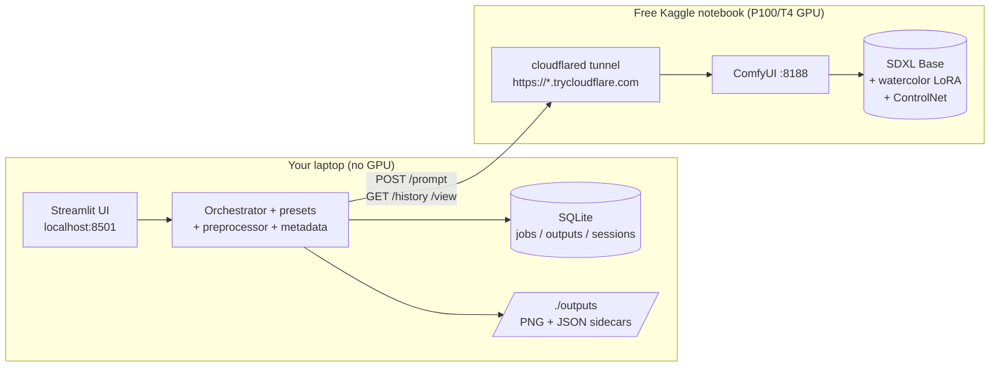
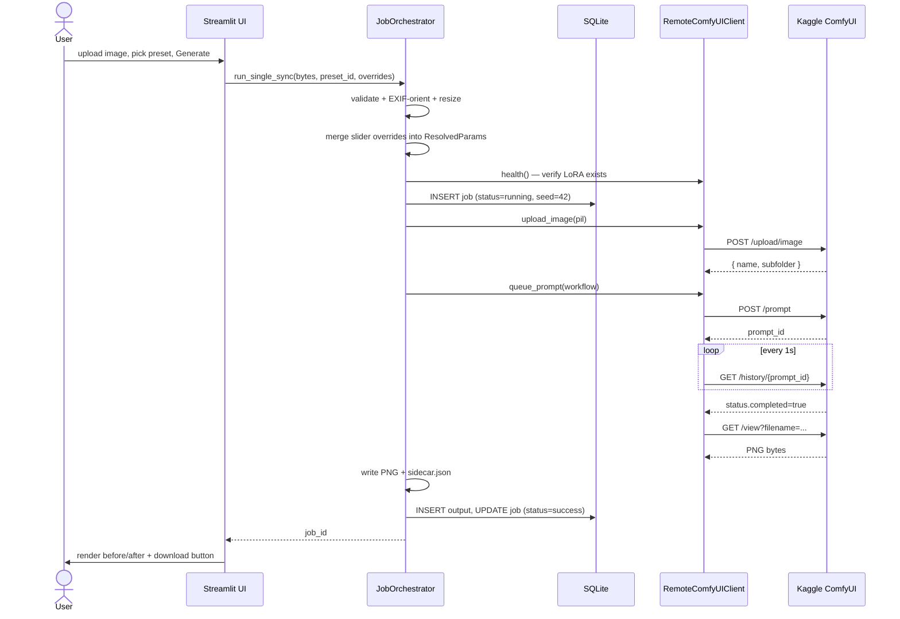
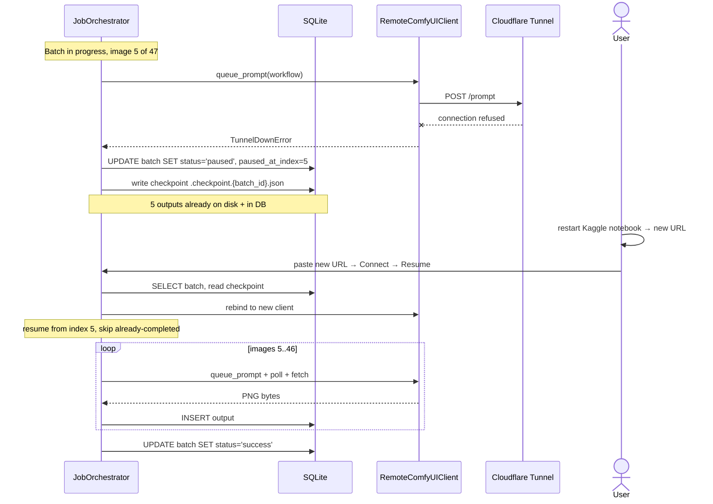

# AquaRender

Local-first watercolor batch image transformer. The Streamlit UI runs on your laptop; the GPU work runs on a free Kaggle notebook exposed over Cloudflare Tunnel. **No paid API. No content filter. No GPU on your laptop.**

## How it works



The free tier ceiling is roughly 30 GPU-hours per week — about 10 thousand 1024×1024 images.

---

## Getting started

### Prerequisites

- **Local laptop:** macOS, Linux, or Windows. Python 3.10–3.12. ~200 MB of disk. **No GPU required.**
- **Kaggle account:** free, signs up in 30 seconds at [kaggle.com](https://www.kaggle.com).
- For development only: [`uv`](https://docs.astral.sh/uv/) (recommended) or `pip`.

### 1. Install the local app

End-user install (one command, isolated env):

```bash
pipx install aquarender
# or
uv tool install aquarender
```

Developer install (clone + editable):

```bash
git clone https://github.com/8lianno/aquarender.git
cd aquarender
uv venv --python 3.11 .venv
uv pip install -e ".[dev]"
```

### 2. Initialize the database

Creates `aquarender.db` next to your install and seeds the four built-in presets (`soft_watercolor`, `ink_watercolor`, `childrens_book`, `product_watercolor`).

```bash
uv run aquarender migrate
```

Verify your setup:

```bash
uv run aquarender doctor
```

You should see Python version, DB writable, outputs dir, and "Wiring: ok". If `AQUARENDER_ENGINE_URL` is set, it will probe the remote engine.

### 3. Boot the engine on Kaggle

The engine is a Kaggle notebook that boots ComfyUI and exposes it through Cloudflare Tunnel. The notebook lives at [`notebooks/aquarender_kaggle.ipynb`](./notebooks/aquarender_kaggle.ipynb).

1. On [kaggle.com](https://www.kaggle.com): **New Notebook → File → Import Notebook**, then either:
   - paste the URL `https://github.com/8lianno/aquarender/blob/main/notebooks/aquarender_kaggle.ipynb`, or
   - download the `.ipynb` first ([raw link](https://raw.githubusercontent.com/8lianno/aquarender/main/notebooks/aquarender_kaggle.ipynb)) and **Upload file**.
2. Right pane → **Settings**:
   - **Accelerator: GPU P100** (or T4 if P100 isn't available)
   - **Internet: On** (required to download SDXL + LoRA from HuggingFace)
3. Click **Run All**. The first run takes ~5 minutes to download ~13 GB of models.
4. The last cell prints:
   ```
   ✅ AquaRender engine ready
   Engine URL:  https://abc-def.trycloudflare.com
   ```
5. **Copy that URL.** It changes every time the notebook restarts.

> **Just want to see one image generated, end-to-end on Kaggle, without the local UI?** Import [`notebooks/aquarender_oneshot.ipynb`](./notebooks/aquarender_oneshot.ipynb) the same way, edit `PROMPT` + `INPUT_IMAGE_URL`, **Run All**. The last cell shows the watercolor inline. Same engine setup, but it skips the tunnel and runs one-shot via `scripts/oneshot.sh` (curl + jq, no Python deps).

### 4. Connect and generate

```bash
uv run aquarender start
```

This opens `http://localhost:8501`. The flow:

1. **Connect** tab → paste the URL from Kaggle → click **Connect**. You'll see green "✅ Connected — Tesla P100, ComfyUI 0.3.x" and a list of available checkpoints, LoRAs, and ControlNets.
2. **Single image** tab → drop an image, pick a preset, click **Generate**. ~20 seconds later you have a watercolor painting + a `.json` sidecar with the full params.
3. **Batch** tab → drop a `.zip` of images or point at a folder → pick preset → **Run batch**. Progress streams live; outputs land in `./outputs/<batch-id>/`.

If the Kaggle session dies mid-batch (9-hour limit, idle timeout, etc.) AquaRender pauses the batch with a checkpoint. Restart the notebook, paste the new URL in **Connect**, then click **Resume** on the Batch tab — already-completed images aren't regenerated.

### 5. Use a custom LoRA

This is the differentiator. Any SDXL LoRA you've uploaded to a Kaggle Dataset shows up automatically.

1. In Kaggle, click **+ Add Data** in your notebook → **Upload** → drop your `.safetensors` file → save as a Dataset.
2. Restart the notebook (the symlink cell picks up new datasets on boot).
3. In AquaRender's **Single image** or **Batch** tab, type the LoRA's filename in the **Custom LoRA** field. The orchestrator pre-flights the request — if the LoRA isn't loaded, you get a typed error before any generation runs.

---

## What happens under the hood

### Single image — happy path



### Tunnel drops mid-batch — pause and resume



---

## Common operations

```bash
# List built-in + user presets
uv run aquarender list-presets

# Check engine connectivity (probes AQUARENDER_ENGINE_URL if set)
AQUARENDER_ENGINE_URL=https://abc-def.trycloudflare.com uv run aquarender doctor

# Pre-fill the engine URL on app startup
uv run aquarender start --external-comfy https://abc-def.trycloudflare.com

# Re-run migrations after pulling
uv run aquarender migrate
```

Outputs land at `./outputs/<YYYY-MM-DD>/` for single jobs, `./outputs/<batch-id>/` for batches. Every PNG has a sibling `.json` with the full `ResolvedParams`, the seed, the engine session id, and the GPU model — so you can regenerate the exact same image later (within the same Kaggle session class — see [docs/ARCHITECTURE.md § Decision 7](./docs/ARCHITECTURE.md)).

---

## Repo layout

| Dir | What lives here |
|-----|-----------------|
| `aquarender/ui/` | Streamlit pages (UI only — never touches HTTP or DB directly) |
| `aquarender/core/` | Pure Python: orchestration, presets, preprocessing, metadata |
| `aquarender/engine/` | Remote ComfyUI client, tunnel monitor, keepalive, workflow builder |
| `aquarender/db/` | SQLAlchemy models, repository pattern, Alembic migrations |
| `aquarender/presets/` | JSON preset files (built-in) |
| `aquarender/params.py` | Pydantic `ResolvedParams` shared by `core/` and `engine/` |
| `workflows/` | The single ComfyUI workflow template (`img2img_controlnet_lora.json`) |
| `notebooks/` | The Kaggle engine notebook |
| `docs/` | PRD, ARCHITECTURE, API, DATABASE, PROMPT |

The layering rule (`ui → core → engine | db`) is enforced by `import-linter` in CI. See [`CLAUDE.md`](./CLAUDE.md).

---

## Development

```bash
uv venv --python 3.11 .venv
uv pip install -e ".[dev]"
uv run aquarender migrate               # schema + seeds
uv run pytest tests/unit                # 25 fast tests, no Kaggle needed
uv run pytest tests/integration         # 6 tests against FakeRemoteComfyUIClient
uv run ruff check --fix .
uv run mypy aquarender                  # strict
uv run lint-imports                     # layering enforcement
```

End-to-end suite against a live tunnel (manual / nightly):

```bash
AQUARENDER_E2E_TUNNEL_URL=https://abc-def.trycloudflare.com uv run pytest tests/e2e
```

---

## Security & privacy

- All processing on the user's own Kaggle session (their account, their compute, their disk).
- No telemetry, no phone-home, no analytics.
- AquaRender does not filter prompts or output images — that's a feature, not a bug. See [`SECURITY.md`](./SECURITY.md) for the threat model and disclosure policy.
- The default `*.trycloudflare.com` URL is **public**. Don't paste it anywhere others can see.

---

## License

[MIT](./LICENSE) — © 2026 Ali Naserifar.
