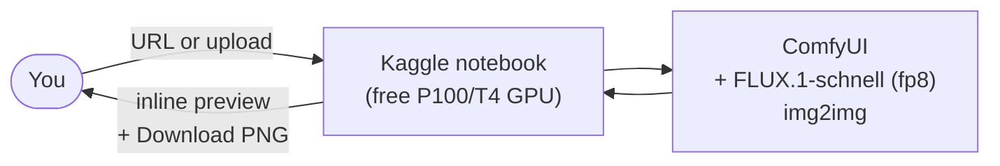

# AquaRender

Drop a photo into a free Kaggle notebook, click Generate, get a watercolor painting back. Powered by **FLUX.1-schnell** (Apache 2.0). **No paid API. No content filter. No GPU on your laptop. No install.**

---

## ⚡ Quick start (zero install — Kaggle or Colab)

Same 3-cell notebook works on both. Auto-detects which environment you're in.

### Kaggle (recommended for sustained use — 30 GPU-hrs/week guaranteed)

1. [kaggle.com](https://www.kaggle.com) → **New Notebook → File → Import Notebook**, paste:
   ```
   https://github.com/8lianno/aquarender/blob/main/notebooks/aquarender_kaggle.ipynb
   ```
2. Right pane → **Settings** → Accelerator: **GPU P100** · Internet: **On**.
3. **Run All**.

### Google Colab (best-effort T4)

1. Open this URL in your browser:
   ```
   https://colab.research.google.com/github/8lianno/aquarender/blob/main/notebooks/aquarender_kaggle.ipynb
   ```
2. Top menu → **Runtime → Change runtime type** → Hardware accelerator: **T4 GPU**.
3. **Runtime → Run all** (or `Ctrl/Cmd + F9`).

### Then on either platform

4. First run downloads the FLUX.1-schnell checkpoint (~17 GB, ~6 min). Re-runs in the same session take ~30 s.
5. Scroll to the last cell. Pick **URL** or **Upload** → pick a **Style** → click **🎨 Generate watercolor**. Result renders inline with a **📥 Download PNG** button.

Three cells total. Nothing on your laptop, no `pipx`, no terminal — just a browser.



---

## What you can tune

The notebook's UI exposes:

| Control | What it does |
|---------|--------------|
| **Input** | URL (auto-fetches the image) or **Upload** a local file |
| **Style** | Soft Watercolor · Ink + Watercolor · Children's Book · Product Watercolor |
| **Strength** | Light · Medium · Strong — scales LoRA weight + denoise together |
| **Seed** | `0` = new random each click; any int = reproducible within the same Kaggle session |

Custom LoRAs: attach a Kaggle Dataset that contains `*.safetensors`; cell 2 symlinks them into ComfyUI's `loras/` folder on the next run.

---

## Limits

- **30 GPU-hours/week** of free Kaggle quota (≈ 10k 1024×1024 images).
- **9-hour hard cap** per session.
- **5-minute idle timeout** if the kernel goes silent — clicking Generate counts as activity.

---

## Repo layout

| Path | What lives here |
|------|-----------------|
| [`notebooks/aquarender_kaggle.ipynb`](./notebooks/aquarender_kaggle.ipynb) | The 3-cell Kaggle notebook (this is the product surface) |
| [`scripts/oneshot.sh`](./scripts/oneshot.sh) | Standalone bash that drives ComfyUI's HTTP API (curl + jq, no Python) — useful for shell automation |
| [`workflows/img2img_controlnet_lora.json`](./workflows/img2img_controlnet_lora.json) | The single ComfyUI workflow template the notebook parametrises |
| `aquarender/` | Python package — UI, core, engine, db. The local Streamlit app for batch jobs. See [Advanced](#advanced-local-streamlit-app) |
| `docs/` | PRD, architecture, API, database, prompt — the why and how |
| [`SECURITY.md`](./SECURITY.md), [`LICENSE`](./LICENSE) | Security policy, MIT license |

---

## Advanced: local Streamlit app

If you want to run **batches** of images with persistent SQLite state, retry failed children, resume across tunnel drops, etc., there's a Python app:

```bash
git clone https://github.com/8lianno/aquarender.git
cd aquarender
uv venv --python 3.11 .venv
uv pip install -e ".[dev]"
uv run aquarender migrate
uv run aquarender start         # http://localhost:8501
```

Architecture for this path: the local Streamlit UI talks to a remote ComfyUI over a Cloudflare Tunnel that you stand up by adapting cell 2 of the Kaggle notebook to launch `cloudflared`. The pieces (orchestrator, preset service, image preprocessor, metadata writer, engine client, tunnel monitor, keepalive task, SQLAlchemy repos, Alembic migrations) all live under `aquarender/` — see [`docs/ARCHITECTURE.md`](./docs/ARCHITECTURE.md) for the full design.

---

## Development

```bash
uv run pytest tests/unit                # 26 fast tests, no Kaggle needed
uv run pytest tests/integration         # 6 tests against FakeRemoteComfyUIClient
uv run ruff check --fix .
uv run mypy aquarender                  # strict
uv run lint-imports                     # layering enforcement
```

`tests/e2e` runs against a live tunnel: `AQUARENDER_E2E_TUNNEL_URL=https://… uv run pytest tests/e2e`.

---

## Security & privacy

- All processing on the user's own Kaggle session (their account, their compute, their disk).
- No telemetry, no phone-home, no analytics.
- AquaRender does not filter prompts or output images — that's a feature, not a bug. See [`SECURITY.md`](./SECURITY.md) for the threat model and disclosure policy.

---

## License

[MIT](./LICENSE) — © 2026 Ali Naserifar.
